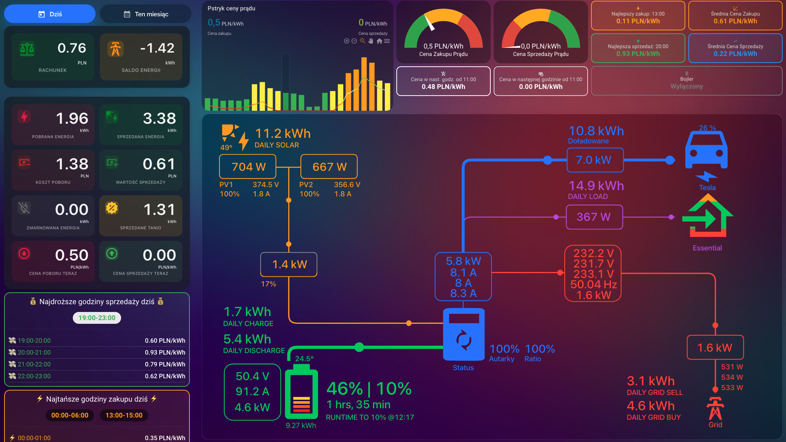

# Pstryk All in One - Home Assistant 

Integracja Home Assistant dla serwisu Pstryk.pl, zapewniająca dostęp do danych o cenach energii (zakup/sprzedaż), zużyciu, produkcji, kosztach i saldzie rozliczeniowym.

## Funkcje

*   Pobieranie aktualnych i przyszłych (jutrzejszych) cen zakupu i sprzedaży energii.
*   Informacje o dziennym i miesięcznym zużyciu/produkcji energii (w kWh).
*   Informacje o dziennych i miesięcznych kosztach/wartości produkcji (w PLN).
*   Saldo rozliczeniowe dzienne i miesięczne (w PLN i kWh).
*   Atrybuty sensorów zawierające szczegółowy podział godzinowy/dzienny danych.
*   Konfigurowalne progi taniej/drogiej energii.
*   Konfiguracja za pomocą Klucza API.

## Instalacja

### Zalecana metoda (HACS)

1.  Upewnij się, że masz zainstalowany HACS.
2.  W Home Assistant przejdź do HACS -> Integracje.
3.  Dodaj to repozytorium jako niestandardowe repozytorium:
    *   W HACS -> Integracje, kliknij trzy kropki w prawym górnym rogu i wybierz "Niestandardowe repozytoria".
    *   Wklej URL tego repozytorium: `https://github.com/kubass4/Pstryk-all-in-one`
    *   Wybierz kategorię "Integracja".
    *   Kliknij "Dodaj".
4.  Znajdź "Pstryk AIO" na liście i kliknij "Zainstaluj".
5.  Uruchom ponownie Home Assistant.

### Instalacja ręczna

1.  Sklonuj to repozytorium lub pobierz pliki ZIP.
2.  Skopiuj katalog `custom_components/pstryk_aio/` do katalogu `custom_components` w konfiguracji Home Assistant.
3.  Uruchom ponownie Home Assistant.

## Konfiguracja

Po ponownym uruchomieniu Home Assistant:

1.  Przejdź do Ustawienia -> Urządzenia i usługi.
2.  Kliknij przycisk "Dodaj integrację".
3.  Wyszukaj "Pstryk AIO".
4.  Wprowadź swój Klucz API Pstryk.pl. Klucz API znajdziesz w panelu Pstryk.pl w sekcji Konto -> Urządzenia i integracje -> Klucz API.
5.  Skonfiguruj opcje, takie jak progi cenowe i interwał aktualizacji.
6.  Zakończ konfigurację.

Integracja utworzy sensory dla dostępnych danych.

## Przykładowe Zastosowanie (Dashboard i Grafiki)

Poniżej znajdują się przykłady, jak można wykorzystać sensory dostarczane przez integrację Pstryk AIO do zbudowania własnych dashboardów i wizualizacji w Home Assistant.

### Przykładowy Dashboard

Możesz stworzyć przejrzysty dashboard pokazujący kluczowe informacje o cenach energii, zużyciu i produkcji.

### Przykładowe Grafiki

Sensory z danymi historycznymi (np. ceny godzinowe, dzienne zużycie) świetnie nadają się do tworzenia wykresów.

## Sensory

Integracja tworzy następujące sensory:

*   `sensor.pstryk_aio_obecna_cena_zakupu_pradu`
*   `sensor.pstryk_aio_cena_zakupu_pradu_jutro`
*   `sensor.pstryk_aio_obecna_cena_sprzedazy_pradu`
*   `sensor.pstryk_aio_cena_sprzedazy_pradu_jutro`
*   `sensor.pstryk_aio_dzienne_koszty_zuzycia_energii`
*   `sensor.pstryk_aio_dzienna_wartosc_produkcji_energii`
*   `sensor.pstryk_aio_saldo_rozliczeniowe_miesieczne_pln`
*   `sensor.pstryk_aio_saldo_energetyczne_miesieczne_kwh`
*   `sensor.pstryk_aio_saldo_rozliczeniowe_dzienne_pln`
*   `sensor.pstryk_aio_saldo_energetyczne_dzienne_kwh`
*   `sensor.pstryk_aio_dzienne_zuzycie_energii_kwh`
*   `sensor.pstryk_aio_dzienna_produkcja_energii_kwh`
*   `sensor.pstryk_aio_miesieczne_zuzycie_energii_kwh`
*   `sensor.pstryk_aio_miesieczna_produkcja_energii_kwh`
*   `sensor.pstryk_aio_miesieczne_koszty_zuzycia_energii_pln`
*   `sensor.pstryk_aio_miesieczna_wartosc_produkcji_energii_pln`

## Wsparcie

Jeśli napotkasz problemy, otwórz zgłoszenie (issue) w tym repozytorium: `https://github.com/kubass4/Pstryk-all-in-one/issues`.

## Autor

kubass4

## Licencja

Ten projekt jest objęty licencją MIT. Szczegóły znajdziesz w pliku LICENSE.
