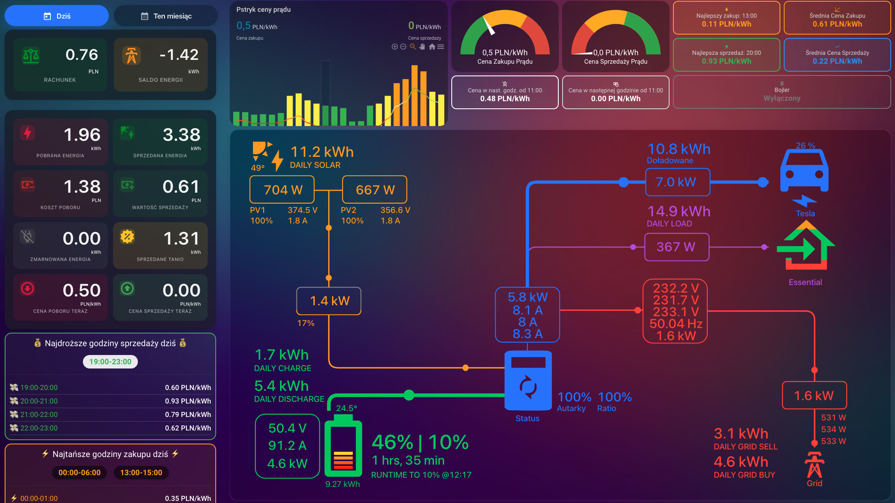
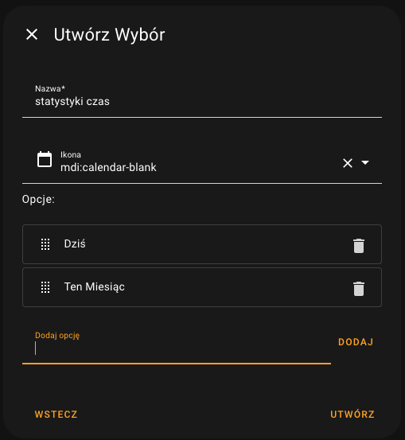
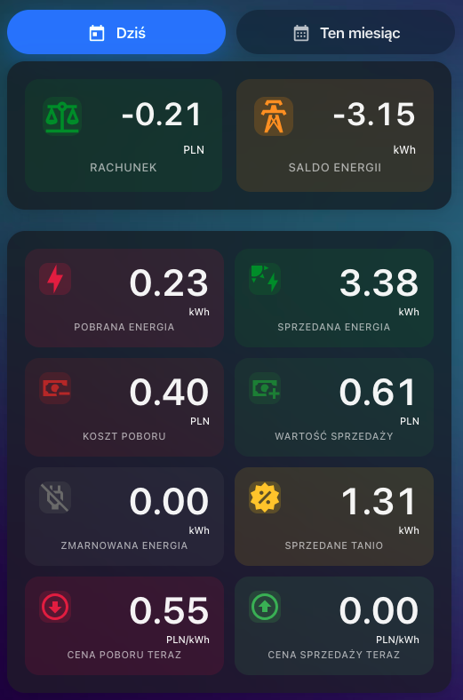
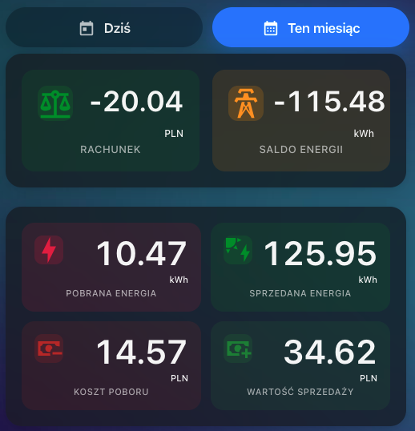

## Dashboardy i Karty

Integracja Pstryk All-in-One dostarcza wielu sensorów, które można wykorzystać do budowy zaawansowanych i informacyjnych dashboardów oraz kart w Home Assistant. Poniżej znajdziesz przykłady oraz inspiracje, jak efektywnie wizualizować dane o zużyciu, produkcji i kosztach energii.

### Wymagane Dodatki (HACS) dla Zaawansowanych Kart

Aby w pełni odtworzyć bardziej złożone karty lub stworzyć własne zaawansowane wizualizacje, będziesz potrzebować następujących dodatków, które można zainstalować przez HACS:

*   **HACS** (jeśli jeszcze nie masz): [Instrukcja instalacji HACS](https://hacs.xyz/)
*   **ApexCharts Card**: Do tworzenia zaawansowanych wykresów. ([GitHub](https://github.com/RomRider/apexcharts-card))
*   **Button Card**: Do tworzenia wysoce konfigurowalnych przycisków i złożonych kart. ([GitHub](https://github.com/custom-cards/button-card))
*   **Mini Graph Card**: Do prostych i eleganckich wykresów liniowych. ([GitHub](https://github.com/kalkih/mini-graph-card))

Upewnij się, że masz zainstalowane te komponenty, jeśli planujesz korzystać z plików zawartych w folderze `dashboards_and_cards`.

---

### 1. Dashboard z wszystkimi kartami

Dashboard, który pokazuje pełne możliwości integracji Pstryk All-in-One. Jeśli potrzebujesz tylko kilku kart z dashboardu, to po jego dodaniu możesz go dowolnie edytować i wykorzystać tylko te karty które są Ci potrzebne.

*   **Dashboard wyświetla:** 
    *   Ceny zakupu i sprzedaży energii elektrycznej dziś.
    *   Ceny zakupu i sprzedaży energii elektrycznej jutro (dane dostępne przeważnie po godzinie 16:00).
    *   Aktualna cena zakupu i sprzedaży energii elektrycznej.
    *   Cena za godzinę zakupu i sprzedaży energii elektrycznej.
    *   Najlepsze ceny zakupu i sprzedaży energii elektrycznej dziś. (Zgodnie z warunkiem tanich(zakup) i drogich cen(sprzedaż), jak nie ma cen spełniających warunek to wyszukuje 5 najlepszych cen.)  
    *   Średnia cena zakupu i sprzedaży energii elektrycznej dziś.
    *   Wykresy:
        *   Ceny zakupu i sprzedaży energii elektrycznej dziś.
        *   Ceny zakupu i sprzedaży energii elektrycznej jutro (dane dostępne przeważnie po godzinie 16:00).
        *   Ostatnie 10dni: Zużycie, Produkcja i Saldo.
    *   Statystyki dzienne i miesięczne dla:
        *   `Rachunek` - Saldo w PLN wysłanej - odebranej energii.
        *   `Saldo Enegii` - Saldo w kWh wysłanej - odebranej energii.
        *   `Pobrana Energia` - Ilość pobranej energii w kWh.  
        *   `Sprzedana Energia` - Ilość sprzedanej energii w kWh.  
        *   `Koszt poboru` - Ilość pobranej energii w PLN.  
        *   `Wartość sprzedaży` - Ilość sprzedanej energii w PLN.
        *   `Zmarnowana Energia` - Ilość wysłanej energii do sieci za 0zł w kWh.  
        *   `Sprzedane Tanio` - Ilość wysłanej energii do sieci w cenie oznaczonej jako tania w konfiguracji (ale nie 0zł/kWh) w kWh.    

*   **Co potrzebujesz:**
    *   Utworzenie pomocnika `input_select.statystyki_czas` (Ustawienia -> Urządzenia oraz usługi -> Pomocnicy -> Utwórz pomocnika -> wybór -> Uzupełnij pola jak na screenie poniżej).
    
    

*   **Wykorzystane dodatki:** `custom:button-card`, `custom:apexcharts-card`, `custom:mini-graph-card`.

*   **Instalacja:**
    *   Upewnij się że masz pomocnika i integracje z punktu wyżej.
    *   skopiuj kod z `dashboards_and_cards/Dashboard.yaml`
    *   W Home Assistant utwórz nowy dashboard (Ustawienia -> Dashboardy -> Dodaj Dashboard)
    *   Przejdź do nowego dashboardu i kliknij w prawym górnym rogu "Edytuj Dashboard" w tym samym miejscu kliknij na 3 kropki i "Edytor konfiguracji YAML"
    *   Usuń zawartość i wklej skopiowany kod.
    *   Zapisz i ciesz się nowym dashboardem.

---

### 2. Karta Podsumowania Dziennego / Miesięcznego

**Widok Dzienny:**

**Widok Miesięczny:**

*   **Opis:** Ta karta wyświetla:
    *   `Rachunek` - Saldo w PLN wysłanej - odebranej energii.
    *   `Saldo Enegii` - Saldo w kWh wysłanej - odebranej energii.
    *   `Pobrana Energia` - Ilość pobranej energii w kWh.  
    *   `Sprzedana Energia` - Ilość sprzedanej energii w kWh.  
    *   `Koszt poboru` - Ilość pobranej energii w PLN.  
    *   `Wartość sprzedaży` - Ilość sprzedanej energii w PLN.
    *   `Zmarnowana Energia` - Ilość wysłanej energii do sieci za 0zł w kWh.  
    *   `Sprzedane Tanio` - Ilość wysłanej energii do sieci w cenie oznaczonej jako tania w konfiguracji (ale nie 0zł/kWh) w kWh.    
    *   `Bieżącą cenę zakupu i sprzedaży` energii elektrycznej.

*   **Co potrzebujesz:**
    *   Utworzenie pomocnika `input_select.statystyki_czas` (Ustawienia -> Urządzenia oraz usługi -> Pomocnicy -> Utwórz pomocnika -> wybór -> Uzupełnij pola jak na screenie poniżej).

    

*   **Wykorzystane dodatki:** `custom:button-card`.

*   **Instalacja:**
    *   Upewnij się że masz pomocnika i integracje z punktu wyżej.
    *   skopiuj kod z `dashboards_and_cards/App_card.yaml`
    *   Przejdź do nowego dashboardu i kliknij w prawym górnym rogu "Edytuj Dashboard"
    *   W dowolnym miejscu gdzie chcesz umieścić kartę kliknij "+" i wybierz "Edytor konfiguracji YAML"
    *   Usuń zawartość i wklej skopiowany kod.
    *   Zapisz i ciesz się nową kartą.